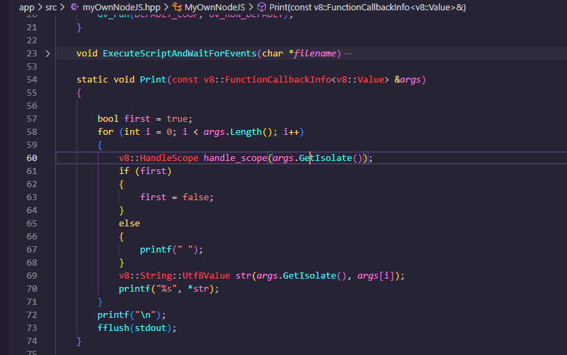
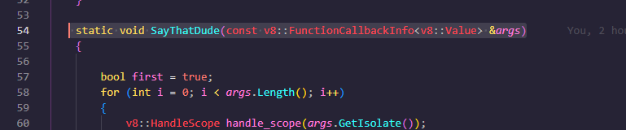
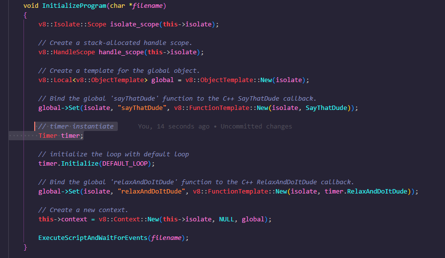
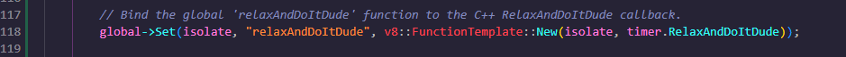
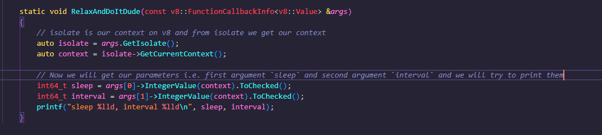
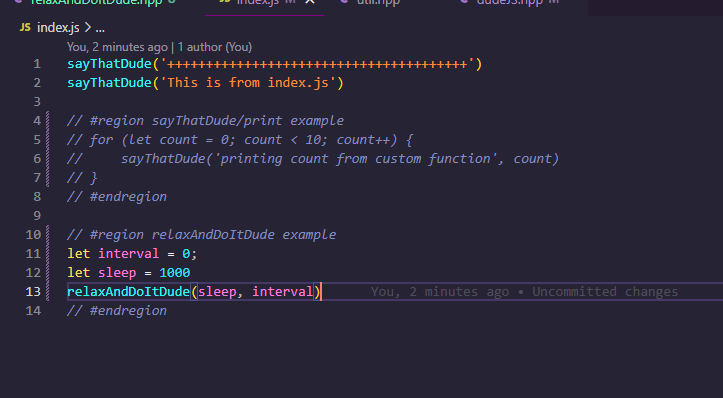
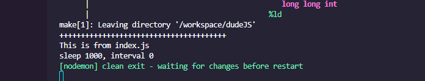
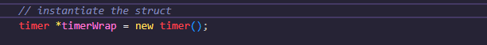

`setTimeout` is one the functionality is implimented in node and not in js. So we will try to impliment our own and we will call it as `relaxAndDoItDude`

`setTimeout(sleep, interval, () => {})` we will try creating something like this.

- Step1) create class in `app/src` and create class file `relaxAndDoItDude.hpp`
  - Then add headers as 
  - To do anything first we need event loop i.e. `uv_loop_t`
  - Then we will add `Initialize` method and assign event loop to local `loop`. This will be static method.
  - Then we need to define our custom CPP `RelaxAndDoItDude` method. This also will be static.
    - We will take reference of `SayThatDude` from `app\src\dudeJS.hpp` for what the signature of that function should look like
    - And craete a similer function signature for `RelaxAndDoItDude` 
  - Now we will bind our CPP `RelaxAndDoItDude` with `relaxAndDoItDude` keyword like how we did for `sayThatDude` in `app\src\dudeJS.hpp`
    - include the header of `relaxAndDoItDude.hpp`  in `app\src\dudeJS.hpp` 
    - and then bind keyword `relaxAndDoItDude` with `RelaxAndDoItDude` by adding Bindings wo global object
      - first we create instance by .
      - Then initialize the loop with default loop 
      - Then add bindings 
    - Now to test this lets try running by running `make build` and `make run`  
    - You will see the output that means it is correctly binded. 
    - Now we will Get arguments using isolate, context, and parameters
      - isolate is our context on v8 and from isolate we get our context 
      - Now we will get our parameters i.e. first argument `sleep` and second argument `interval` and we will try to print them
      - Try rerunning by 
      - We will see output as  that means we are getting args as we needed.
      - Now we will try to get third arg i.e. callback. first we parse it to string as Utf8Value.. then give name as callbackStr and get args and print that string.  
      - lets try running index.js with this example 
      - You'll see output as 
    - Now the next part is Implementing a timeout function
      - Lets create `struct` which kind of like a class and `uvTimer` as one of its property 
      - instantiate that `struct` 
      - the `uv_timer_init` will take this `uvTimer` and initialize it which will pass later to the `uv_timer_start`
      - 
      - we will use `uv_timer_init` which initialize the timer and it takes event loop as input param and uvTimer of type `uv_timer_t`
      - `uv_timer_start` which starts the timer and it takes the callback which to be called, how much time it should sleep for and the interval
      - Now if we run this example in index.js 
      - you'll see it'll first print  and after it'll print  That means timer is working fine..Its not calling our callback but the onTimerCallback
    - Now lets try working on our calling our own callback function that we pass
      - 