`setTimeout` is one the functionality is implimented in node and not in js. So we will try to impliment our own and we will call it as `relaxAndDoItLaterDude`

`relaxAndDoItLaterDude(sleep, interval, () => {})` we will try creating something like this.

# What and how was my thought process 
- create class in `app/src` and create class file `relaxAndDoItLaterDude.hpp`
- Then add headers as 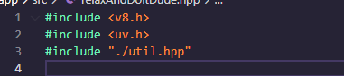
- To do anything first we need event loop i.e. `uv_loop_t`
- Then we will add `Initialize` method and assign event loop to local `loop`. This will be static method.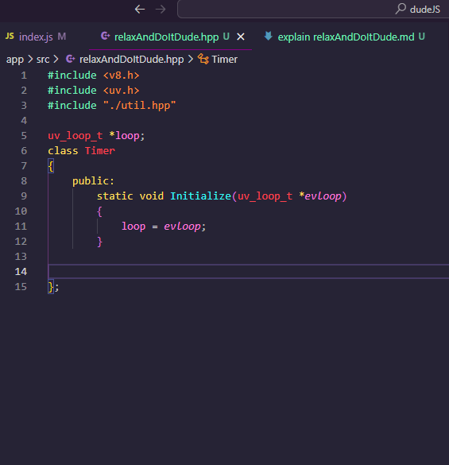
- Then we need to define our custom CPP `RelaxAndDoItLaterDude` method. This also will be static.
  - We will take reference of `SayThatDude` from `app\src\dudeJS.hpp` for what the signature of that function should look like
  - And craete a similer function signature for `RelaxAndDoItLaterDude` 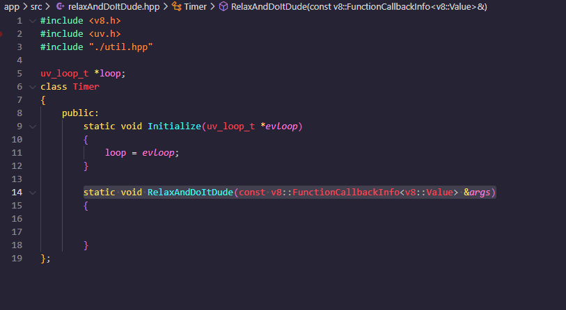
- Now we will bind our CPP `RelaxAndDoItLaterDude` with `relaxAndDoItLaterDude` keyword like how we did for `sayThatDude` in `app\src\dudeJS.hpp`
  - include the header of `relaxAndDoItLaterDude.hpp`  in `app\src\dudeJS.hpp` 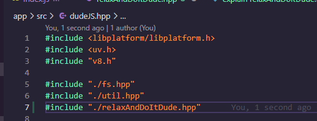
  - and then bind keyword `relaxAndDoItLaterDude` with `RelaxAndDoItLaterDude` by adding Bindings wo global object
    - first we create instance by .
    - Then initialize the loop with default loop 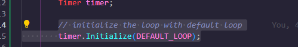
    - Then add bindings 
  - Now to test this lets try running by running `make build` and `make run` 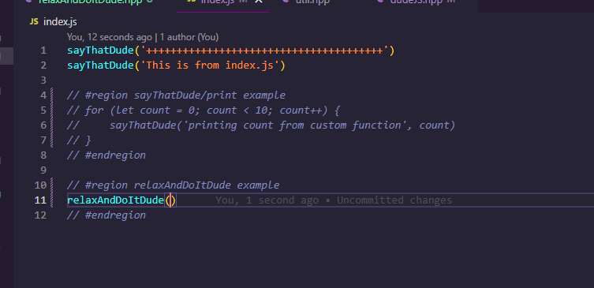 
  - You will see the output that means it is correctly binded. 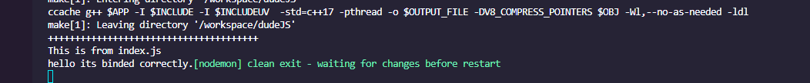
  - Now we will Get arguments using isolate, context, and parameters
    - isolate is our context on v8 and from isolate we get our context 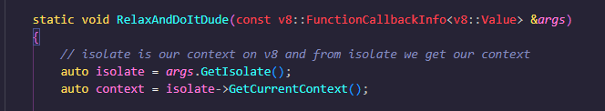
    - Now we will get our parameters i.e. first argument `sleep` and second argument `interval` and we will try to print them
    - Try rerunning by 
    - We will see output as  that means we are getting args as we needed.
    - Now we will try to get third arg i.e. callback. first we parse it to string as Utf8Value.. then give name as callbackStr and get args and print that string.  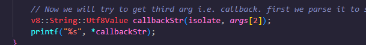
    - lets try running index.js with this example 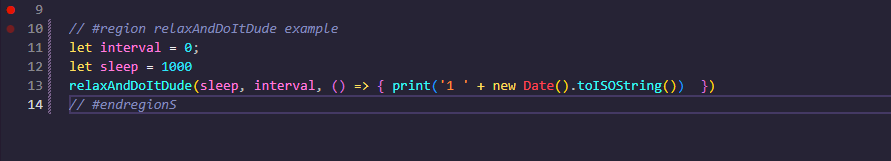
    - You'll see output as 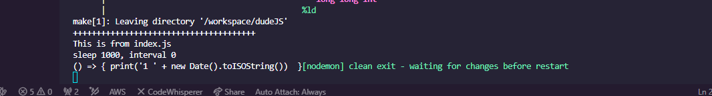
  - Now the next part is Implementing a timeout function
    - Lets create `struct` which kind of like a class and `uvTimer` as one of its property 
    - instantiate that `struct` 
    - the `uv_timer_init` will take this `uvTimer` and initialize it which will pass later to the `uv_timer_start`
    - 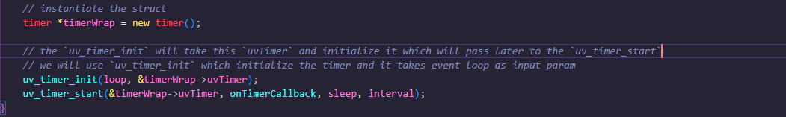
    - we will use `uv_timer_init` which initialize the timer and it takes event loop as input param and uvTimer of type `uv_timer_t`
    - `uv_timer_start` which starts the timer and it takes the callback which to be called, how much time it should sleep for and the interval
    - Now if we run this example in index.js 
    - you'll see it'll first print 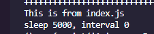 and after it'll print  That means timer is working fine..Its not calling our callback but the onTimerCallback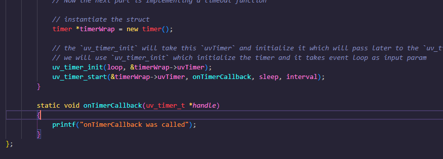
  - Now lets try working on our calling our own callback function that we pass
    - We need to store the function that we pass and execute it. For this we will need to create context for it also.
    - So we create isolate and place to store the function for that we need global state cause if we dont use it v8 will remove it. We will do this in `struct`
    - We will be resetting the instance of `struct` as it has instance by default. Also we wont use this  we creted before so can comment it. We will create new variable for storing the callback function from 3rd argument by `v8::Local<v8::Value> callback = args[2];` `Local` indicates that it will only work on local context 
    - Also lets check if call back is function if not we will return 
    - Notice while resetting we are casting callback to function  
    - Now `uvTimer` has data proeprty where we need to pass the data that we created in our `struct` so we can do that by assigning `timerWrap` to `uvTimerd.data`
    - We access this data in `onTimerCallback` by `handle` as its nothing but `uvTimer` and create pointer `*timerWrap` to access it 
    - Also we access isolate same way as above and create a context 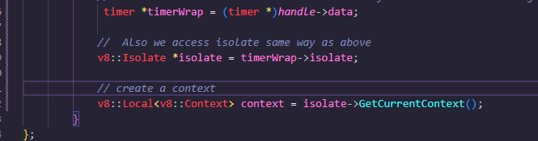
    - we create ne function by `New` with our isolate and callback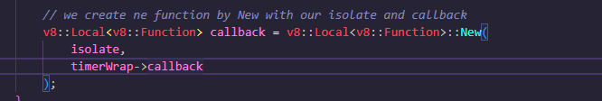
    - Now we call our callback
      - in order to call it we need to pass 
      - we call it like this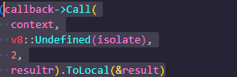 and it returns a boolean so we add it in if loop
      - 
    - Now if we run below example in index.js 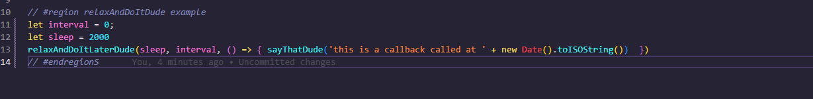
    - It will call the actual call back function that we send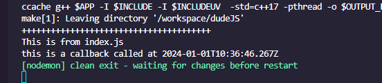
    - We can run nested examples as well like these 

## We can create our own setTimeout
- `setTimeout` is nothing but `relaxAndDoItLaterDude` with 0 interval. So defination looks like this
- `setInterval` is nothign but sleep of 0 
- 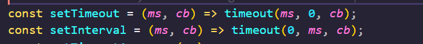
