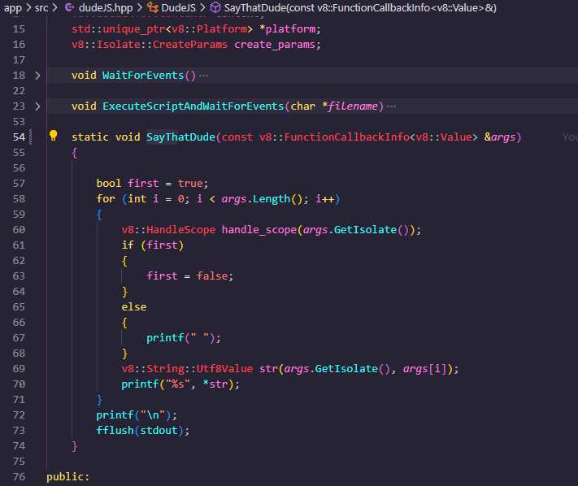
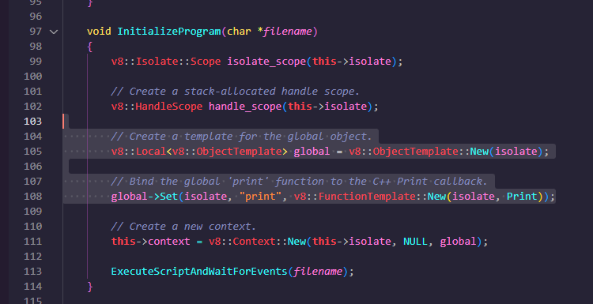

JS doesnt have console.log  its something that is provided by node in case of server and document in case of frontend object in browser. We have implimented our own console.log we will call it sayThatDude

- 
  - here we are just iterating through the arguments and printing them using printf. You can check this by utilizing this in index.js. If you enter `console.log` or `setTimeout` it wont work cause its not native js.

- 
  - we are binding this c++ custom `SayThatDude` function with js `sayThatDude` keyword here  